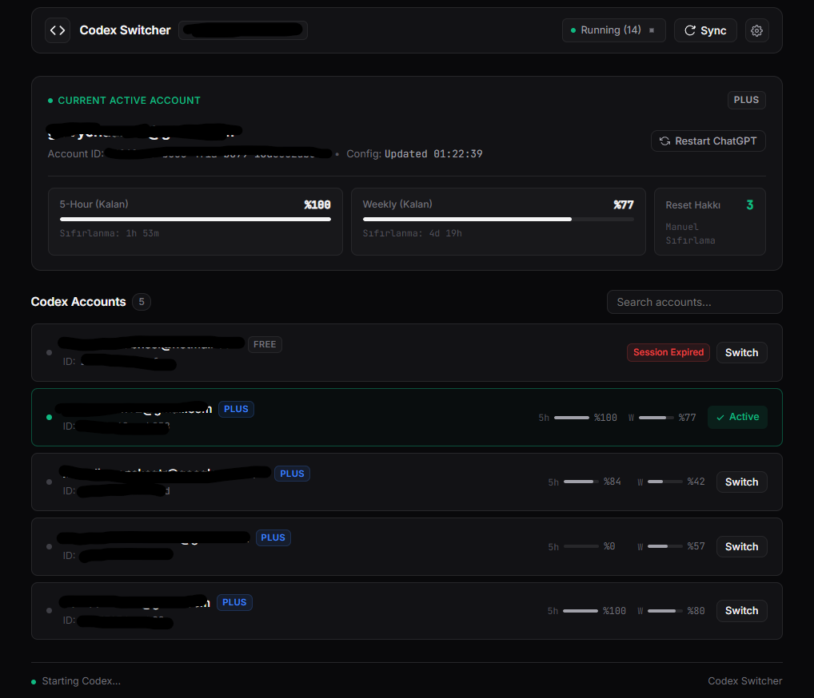

# Codex Switcher (Türkçe Döküman)

<p align="center">
  
</p>

<p align="center">
  <b>OpenAI Codex ve ChatGPT Masaüstü Uygulaması için sade, modern Windows hesap değiştirici ve kota takip paneli.</b>
</p>

<p align="center">
  <a href="README.md"><b>English</b></a> •
  <a href="README.tr.md"><b>Türkçe</b></a>
</p>

<p align="center">
  
  
  
  
  
</p>

---

## Öne Çıkan Özellikler

- **Tek Tıkla Sorunsuz Hesap Değiştirme**: `~/.codex/auth.json` kimlik bilgilerini saniyeler içinde değiştirir.
- **Otomatik Süreç Yönetimi**: Hesap değişirken açık `ChatGPT.exe` ve `codex.exe` süreçlerini nazikçe sonlandırır, `auth.json` güncellendikten sonra resmi Windows Store ChatGPT Masaüstü Uygulamasını (`OpenAI.Codex_2p2nqsd0c76g0!App`) otomatik olarak başlatır (arka plan sistem servislerine dokunmaz).
- **Canlı Kalan Kota Takibi**: OpenAI WHAM kullanım API'si ile doğrudan entegre olarak **5 Saatlik Oturum** ve **Haftalık Limit** için **kalan** yüzdeyi, sıfırlanma geri sayımını ve reset haklarını gösterir.
- **9Router Veritabanı Senkronizasyonu**: 9Router sunucunuza giriş yaparak veritabanını çeker, diğer sağlayıcıları ayıklayarak yalnızca gerçek Codex hesaplarını listeler.
- **Otomatik Güvenli Yedekleme**: Her hesap değişiminden önce `~/.codex/backups/auth.json.bak.<tarih>` konumuna otomatik zaman damgalı yedek alır.
- **Kendini Yenileyen Token Desteği**: Süresi dolmuş oturumları tespit eder ve OpenAI OAuth uç noktası üzerinden arka planda otomatik olarak yeniler.
- **Çift Dil Desteği (TR / EN)**: Üst menüden tek tıkla Türkçe veya İngilizce arayüze geçiş; dile duyarlı yüzde (`%77` / `77%`) ve zaman formatı.
- **Sade ve Modern Tasarım**: Linear / Vercel tarzı, göz yormayan, gereksiz parlamalardan arındırılmış koyu tema.

---

## Nasıl Çalışır?

```
┌─────────────────────────────────┐
│     9Router Veritabanı          │ (Codex sağlayıcı hesaplarını çeker ve filtreler)
└────────────────┬────────────────┘
                 │
                 ▼
┌─────────────────────────────────┐
│      OpenAI WHAM Kullanım API   │ (5s ve haftalık kalan kotaları sorgular)
└────────────────┬────────────────┘
                 │
                 ▼
┌─────────────────────────────────┐
│   Güvenli Süreç ve Dosya Değişimi│
│  1. Açık ChatGPT.exe'yi kapat   │
│  2. auth.json'ı yedekle ve yaz  │
│  3. ChatGPT Masaüstü App'i aç   │
└─────────────────────────────────┘
```

1. **Kimlik Bilgisi Yönetimi**:
   Uygulama doğrudan Windows kullanıcı dizinindeki `~/.codex/auth.json` dosyasını yönetir. JWT verisini çözümleyerek plan türü (`chatgpt_plan_type`) ve hesap ID'si bilgilerini dinamik olarak ayrıştırır.

2. **Windows Masaüstü Entegrasyonu**:
   ChatGPT Masaüstü uygulaması Microsoft Store üzerinden kurulduğunda `OpenAI.Codex_2p2nqsd0c76g0!App` kimliğine ve `ChatGPT.exe` süreç adına sahip olur. Uygulama, CLI yerine doğrudan bu resmi uygulamayı güvenle yeniden başlatır.

3. **Kota ve Limit Analizi**:
   Tarayıcı başlıklarıyla `https://chatgpt.com/backend-api/wham/usage` servisine bağlanır; kullanılan miktarı değil **kalan** kota oranını ve sıfırlanma süresini görsel çubuklarla sunar.

---

## Kurulum ve Başlangıç

### Gereksinimler

- **Windows 10 / 11**
- **Node.js** (v18.0 veya üzeri)
- **ChatGPT Windows Masaüstü Uygulaması** (Microsoft Store)
- Bir **9Router** sunucu adresi ve şifresi

### Adım Adım Kurulum

1. **Projeyi indirin veya klonlayın:**
   ```bash
   git clone https://github.com/kullanici-adiniz/CodexSwitcher.git
   cd CodexSwitcher
   ```

2. **Bağımlılıkları yükleyin:**
   ```bash
   npm install
   ```

3. **Yapılandırma (İsteğe Bağlı):**
   > [!TIP]
   > `.env` dosyasıyla uğraşmanıza gerek yoktur! Uygulamayı açtıktan sonra sağ üstteki **Ayarlar (Settings)** butonundan 9Router adresinizi ve şifrenizi bir defa girmeniz yeterlidir. Tüm ayarlarınız ve önbelleğiniz `~/.codex` dizininde kalıcı olarak saklanır; böylece `.exe` güncellense de, kapatılıp açılsa da veya `npm run dev` yapılsa da bilgileriniz kaybolmaz.
   
   Dilerseniz geleneksel olarak `.env` dosyasını da kullanabilirsiniz (`.env.example` dosyasını `.env` olarak kopyalayarak).

4. **Uygulamayı başlatın:**
   - **Masaüstü Uygulaması (.exe)** *(En Pratik)*:
     Windows üzerinde doğrudan `CodexSwitcher.exe` dosyasına çift tıklayın! Herhangi bir siyah terminal penceresi veya tarayıcı sekmesi açılmadan, doğrudan kendi şık masaüstü penceresiyle açılır.
   - **Geliştirme / Komut Satırından Çalıştırma**:
     ```bash
     npm start   # veya npm run dev (Masaüstü uygulamasını açar)
     ```
   - **Yeniden .exe Paketleme**:
     ```bash
     npm run build
     ```

---

## Proje Dizini

```
CodexSwitcher/
├── assets/
│   └── screenshot.png         # Arayüz ekran görüntüsü
├── lib/
│   ├── codexManager.js        # Auth.json yönetimi, yedekleme ve ChatGPT başlatıcı
│   ├── routerClient.js        # 9Router giriş ve veritabanı ayrıştırıcı
│   └── usageClient.js         # OpenAI WHAM kota sorgulama ve token yenileyici
├── public/
│   ├── app.js                 # Ön yüz mantığı, durum yönetimi ve TR/EN i18n
│   ├── index.html             # Semantik HTML şablonu
│   └── style.css              # Minimal koyu tema stilleri
├── .env.example               # Örnek ortam değişkenleri
├── .gitignore                 # Git dışlama kuralları
├── package.json               # Paket bağımlılıkları ve betikler
├── README.md                  # İngilizce Dökümantasyon (Varsayılan)
├── README.tr.md               # Türkçe Dökümantasyon
└── server.js                  # Express API sunucusu
```

---

## API Uç Noktaları

| Uç Nokta | Yöntem | Açıklama |
|---|---|---|
| `/api/status` | `GET` | Aktif hesap, kalan limitler, router durumu ve süreç bilgisini döner |
| `/api/sync` | `POST` | 9Router'a bağlanır, hesapları çeker ve güncel limitlerle harmanlar |
| `/api/switch` | `POST` | ChatGPT'yi kapatır, `auth.json` günceller ve uygulamayı yeniden açar |
| `/api/config` | `POST` | Router adresi ve şifresini `~/.codex/switcher_config.json` içine kaydeder |
| `/api/codex/stop` | `POST` | Açık olan ChatGPT masaüstü süreçlerini kapatır |
| `/api/codex/start` | `POST` | ChatGPT Windows masaüstü uygulamasını başlatır |

---

## İpuçları

- **Dil Değiştirme**: Üst menüdeki **TR** veya **EN** butonuna tıklayarak arayüz dilini anında değiştirebilirsiniz.
- **Arama**: E-posta veya hesap ID'sine göre anlık filtreleme yapabilirsiniz.
- **Kısayol**: Pencereleri kapatmak için `Esc` tuşuna basabilir veya dışarıya tıklayabilirsiniz.
- **Geliştirme**: `npm run dev` komutu Node.js'in yerleşik `--watch` mekanizmasını kullandığı için dosya değişikliklerinde anında güncellenir.

---

## Lisans

Bu proje [MIT Lisansı](LICENSE) kapsamında lisanslanmıştır.
